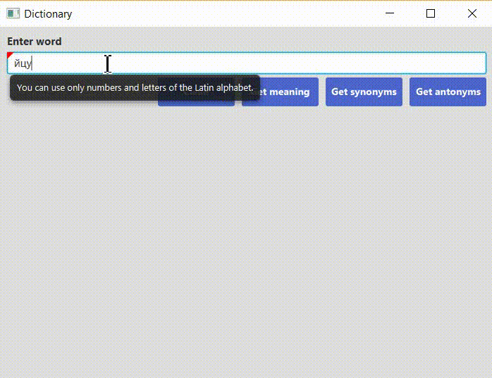

# Dictionary

## Основной функционал
По нажатию на кнопку делается запрос через интернет к удаленному серверу. 
Можно получить значение, синонимы и антонимы слова.

## Валидация
Есть валидация полей

## Очистка
Можно производить очистку полученного результата.

